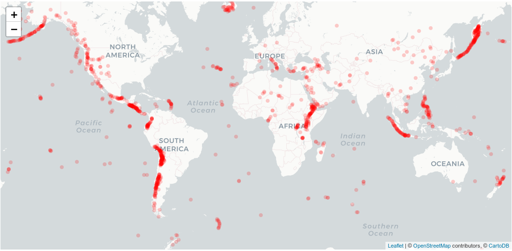

<div align="center">
<a href="https://www.cemac.leeds.ac.uk/">
  </a>
  <br>
</div>

 <h1> <center> COMET VOLC DB </center> </h1>

  [](https://github.com/cemac/COMET_VolcDB) [](https://github.com/cemac/COMET_VolcDB/issues) [](https://github.com/cemac/COMET_VolcDB/commits/master) [](https://github.com/cemac/COMET_VolcDB/releases)


Repository for the [COMET](www.comet.nerc.ac.uk) Volcano Database hosted at [comet.nerc.ac.uk/comet-volcano-portal](https://comet-volcanodb.org/)

[](https://zenodo.org/badge/latestdoi/197738447)



<hr>

## Requirements

* anaconda (reccomended) *see environment.yml*
* SQLlite
* git-crypt (or own .env file *see Developers Guide*)

requirements.txt is provided for full package version information and installing via other means.

## Installation (UNIX)

Install via git and anaconda

```bash
git clone https://github.com/cemac/COMET_VolcDB.git
cd COMET_VolcDB
conda env create -f environment.yml
conda activate cometapp
```

<hr>

## Usage

*Coming soon Recommended to write wiki for Developers and site Users*

* [Developer Guide](https://github.com/cemac/COMET_VolcDB/wiki/Developer_guide)
* [Users]()

<hr>

## Backups

*comming soon*

<hr>

<!--- release table -->


|  Version            | Release          |
|---------------------|------------------|
|  Beta-1.0 July 2020 | [](https://github.com/cemac/COMET_VolcDB/releases/tag/1.0-beta)|
|  Beta-1.1 Feb 2021  | [](https://github.com/cemac/COMET_VolcDB/releases/tag/1.1-beta)|


<!--- table -->

## License Information

LGPL-3.0 License 

## Acknowledgements

 Richard Rigby; Burns, Helen; Watson, C. Scott; Lazecky, Milan; Ebmeier, Susanna; Morishita, Yu; Maghsoudi Mehrani, Yasser; Elliott, John; Wright, Tim

## References

* [https://github.com/universityofleeds/volcano-database](https://github.com/universityofleeds/volcano-database)
